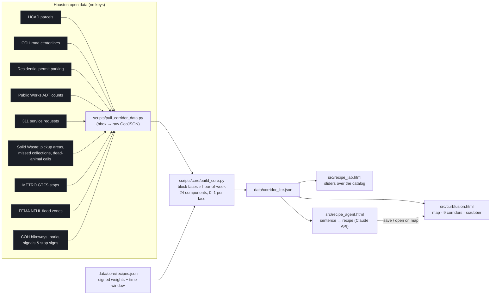

# AITX Hackathon 2026

Project repo for the [Houston AITX Community Hackathon](https://common-scooter-829.notion.site/Houston-AITX-Community-Hackathon-3d81e636288e80d7bf5fc5950e9ac998) (Sep 19, 2026, POST Houston).

Full event details, tracks, and judging criteria are captured in [docs/hackathon-info.md](docs/hackathon-info.md).

## Shared build coordination

Start with [the shared build plan](docs/SHARED_BUILD_PLAN.md), [the data contract](docs/DATA_CONTRACT.md), and [agent ownership rules](AGENTS.md). The MVP is Curb Fusion: a block-face × hour-of-week curb model for Washington Avenue, with one Leaflet interface. Agent A owns context data and UI; Agent B owns core geography and modeling. The plan records current readiness and the larger digital-twin roadmap.

## Track

- [ ] Agents Track
- [x] Houston Open Data Track
- [ ] Most Commercializable Track

## Project

**Name:** CurbFusion — Team Trash Pandas

**One-liner:** Overlays Houston public datasets on a common unit — block face × hour of week — to surface curb-parking demand *and* raccoon-foraging patterns no single dataset records.

**Problem:** Curb-parking conflicts on corridors like Washington Ave (residents vs. commercial visitors vs. permit parking) aren't visible in any single city dataset — you have to cross-reference parcels, permits, road data, and complaints by hand. Meanwhile the same 311 trash/complaint data that describes curb pressure also describes where a raccoon would have a great night.

**Solution:** A pipeline that pulls 18+ public layers — HCAD parcels, road centerlines, residential permit parking, Public Works ADT, METRO GTFS, 311 service requests, Solid Waste pickup areas/missed collections/dead-animal calls, FEMA flood zones, COH bikeways, parks, and traffic control points — snaps them to ~1,300+ block faces per corridor, and exposes them as 0–1 scoring components. A **recipe** is a named, signed set of weights over those components plus a time window: Curb pressure and Raccoon forage ship as the two built-in recipes, alongside five more (delivery driver, food truck Friday, homebuyer quiet-and-dry, city ops...). The main map (`src/curbfusion.html`) renders it all with a time-of-week scrubber, a mode switch across all recipes plus a client-side Combined-risk view, a Streets/Satellite basemap toggle that shifts visually from day to evening to night, and an address search that jumps anywhere in Houston and honestly reports whether that block is modeled yet. Two companion pages let anyone build their *own* recipe: **Recipe Lab** (`src/recipe_lab.html`, drag sliders over the component catalog) and **Recipe Agent** (`src/recipe_agent.html`, describe a need in a sentence and an LLM proposes the weights). The map covers **nine real Houston corridors** — all six historic wards plus three commercial corridors — and the pipeline takes any bounding box.

**Who's the user / customer:** City planners and PBD/civic districts (curb pressure), Solid Waste ops (complaint stacking), logistics and food trucks (where to stop), homebuyers (quiet + dry) — built so a non-technical city official can search their block, drag a slider, and get a plain-English read instead of raw scores. The raccoon proves the framework is need-agnostic.

**Caveats:** Scores are uncalibrated proxies, not measurements; 311 is a multi-year open-case snapshot, not a complete window; Washington Ave's permit-hours rule is a labeled scenario, not verified law. Every constant is recorded in `data/core/assumptions.json`.

See [docs/HANDOFF.md](docs/HANDOFF.md) for the full data contract and build order, [docs/MODEL.md](docs/MODEL.md) / [docs/SCORING.md](docs/SCORING.md) for how components become scores, and [docs/DEMO.md](docs/DEMO.md) for the presentation script.

### Corridors & scaling beyond one street

Washington Ave has the deep dataset (311, solid-waste schedules, ADT, flood/bike/park layers, Raccoon mode). The other eight corridors — all five remaining historic wards plus three commercial strips — are built from a generalized, bbox-parameterized pipeline (`scripts/core/build_new_corridor.py`) using the same real, live Houston/ArcGIS endpoints (HCAD parcels, road centerlines, residential permit parking, no auth) and real OSM ward boundaries. They deliberately don't fake Raccoon mode or a permit-district scenario they have no data for — the UI shows a "not pulled yet for this corridor" note instead of inventing numbers. Adding another corridor anywhere in Houston is one command:

```bash
python scripts/core/build_new_corridor.py <slug> "<Label>" <minlon> <minlat> <maxlon> <maxlat>
# then add an entry to data/areas.json pointing at data/areas/<slug>/corridor_lite.json
python scripts/core/build_html.py
```

## Getting Started

```bash
# clone
git clone https://github.com/createnexxusvision/AITXHackathon2026.git
cd AITXHackathon2026

# backend deps (re-pulling data / rebuilding the model)
pip install pyshp "shapely>=2" pyproj

# re-pull source data from Houston open data endpoints (data/*.geojson already committed)
python scripts/pull_corridor_data.py

# rebuild data/core/*.json + data/corridor.json + data/corridor_lite.json (Washington Ave)
python scripts/core/build_core.py

# inline everything into three self-contained demo files (no server needed to view them)
python scripts/core/build_html.py
# -> src/curbfusion.html (main map, all 9 corridors), src/recipe_lab.html, src/recipe_agent.html
# double-click any of them, or:
python -m http.server
# open http://localhost:8000/src/curbfusion.html
```

`src/app.py` is a Streamlit/pydeck alternative viewer: `pip install streamlit pydeck && streamlit run src/app.py`.

**Recipe Agent** calls Claude to turn a sentence into a recipe. It needs an API key — either paste one into the `KEY` constant in `src/recipe_agent.template.html` for a quick demo, or run the bundled local proxy so the browser never holds the key: `pip install fastapi uvicorn httpx && ANTHROPIC_API_KEY=sk-ant-... uvicorn tools.recipe_proxy:app --port 8765`, then point `API` at `http://localhost:8765/v1/messages`.

## Repo Structure

```
.
├── agents/     # agent status/coordination files (see AGENTS.md)
├── data/       # Washington Ave data + corridor.json/corridor_lite.json; areas.json lists all corridors
│   ├── areas/  # per-corridor data + corridor_lite.json for the non-Washington-Ave corridors
│   └── core/   # faces.geojson, manifest.json, assumptions.json, recipes.json
├── docs/       # hackathon info, build plan, data contract, model + scoring notes, demo script, handoff notes
├── scripts/    # data pull + model build scripts (scripts/core/ is the current pipeline;
│               #   build_new_corridor.py adds any new corridor from a bounding box)
├── src/        # curbfusion.html (main demo), recipe_lab.html, recipe_agent.html,
│               #   app.py (Streamlit alt), index.html (older reference)
├── tools/      # recipe_proxy.py — local key-hiding proxy for the Recipe Agent
├── tests/      # automated tests
├── AGENTS.md   # agent/collaborator ownership rules
└── README.md
```

## Architecture



Scoring runs in the browser: `score[h] = 100 × Σ(w·component)/Σ|w| × window[h]`. The agent gets the component catalog plus the user's sentence and returns weights, reasons, a time window, and a list of data it wanted but the catalog lacks.

## Datasets & provenance

All public, pulled live over HTTPS with no authentication. Sources, retrieval dates, and counts are recorded in `data/core/manifest.json`; every modeling constant in `data/core/assumptions.json`. No synthetic data. Counts below are for the Washington Ave corridor's full-depth pull; the other eight corridors carry parcels/centerlines/permit segments only (see [Corridors & scaling](#corridors--scaling-beyond-one-street) above).

| Dataset | Publisher / endpoint | Used for |
|---|---|---|
| HCAD parcels (4.2k) | City of Houston GIS `HCAD_Parcels` | land-use acreage per face (A1/B1/B2/F1/C1/C2) |
| Road centerlines (2.7k) | City of Houston GIS `COH_RoadCenterline` | block-face geometry, capacity |
| Residential Permit Parking (79) | City of Houston GIS `Residential_Parking_Permit_3` | time-based restrictions |
| ADT traffic counts (122 stations) | Public Works TDO `Traffic_gx` + assignments table | traffic volume |
| 311 service requests (2k, multi-year open snapshot) | `mycity2.houstontx.gov` 311 map services | trash/parking/tree/streetlight components |
| Solid Waste pickup areas (garbage / recycling / heavy / yard) | City of Houston GIS `COH_Solid_Waste_*` | pickup-night curves |
| Missed collections (3.1k), dead-animal calls (387) | City of Houston GIS `RoutewareCollectionExceptions`, `DeadAnimalCollection` | event components |
| METRO stops (204) | METRO GTFS static `stops.txt` | transit context |
| FEMA NFHL flood zones (98 polygons) | `hazards.fema.gov` NFHL layer 28 | flood component |
| Bikeways (471), parks (39), signals (99), stop signs (1.6k) | City of Houston GIS / TDO | supply & context components |
| Washington Ave PBD boundary (2013) | data.houstontx.gov | scenario boundary |

Licensed / partner datasets shown greyed in the Recipe Agent (meter transactions, citations, Waymo pickups, foot-traffic panels, Popular Times, satellite imagery) are **not** included; they are surfaced as the agent's wishlist.

## Known limitations & next steps

- Scores are uncalibrated proxies with per-face `confidence`; nothing is measured occupancy.
- 311 coverage is a multi-year open-case snapshot (report-time bins), not a complete observation window.
- The Washington Ave permit rule (Thu–Sun 18–02) is a labeled scenario, not verified law.
- Full-depth data covers one ~20 km² rectangle; the eight other corridors carry parcels, centerlines, and permit segments only. City ArcGIS services throttle deep pagination, which has so far stopped a citywide pull.
- Bikeway join (40 ft) over-matches on signed shared streets.

Next: citywide pull as a tiled nightly job served as vector tiles (PMTiles), recipe scoring per viewport; TABC licenses, crash history, tree canopy, bus frequency as new components; meter transactions from ParkHouston to calibrate the model; recipes as the product.

## Reproduce the demo

No env vars are needed for the map or Recipe Lab. Recipe Agent needs `ANTHROPIC_API_KEY` (see [Getting Started](#getting-started) above); sample `.env`:

```
ANTHROPIC_API_KEY=sk-ant-...
```

## Demo

- Video: `<LOOM LINK>` — add once recorded (see [docs/LOOM_SCRIPT.md](docs/LOOM_SCRIPT.md))
- Working app: open `src/curbfusion.html` (no server needed); Recipe Agent at `src/recipe_agent.html`.

## Team — Trash Pandas

| Name | Role | Contact |
|---|---|---|
| Danny | frontend, map, day/night, corridors, search/share, integration | — |
| Brian | data pipeline (18+ public layers), block-face model, scoring & recipe system, Recipe Agent, docs | — |
