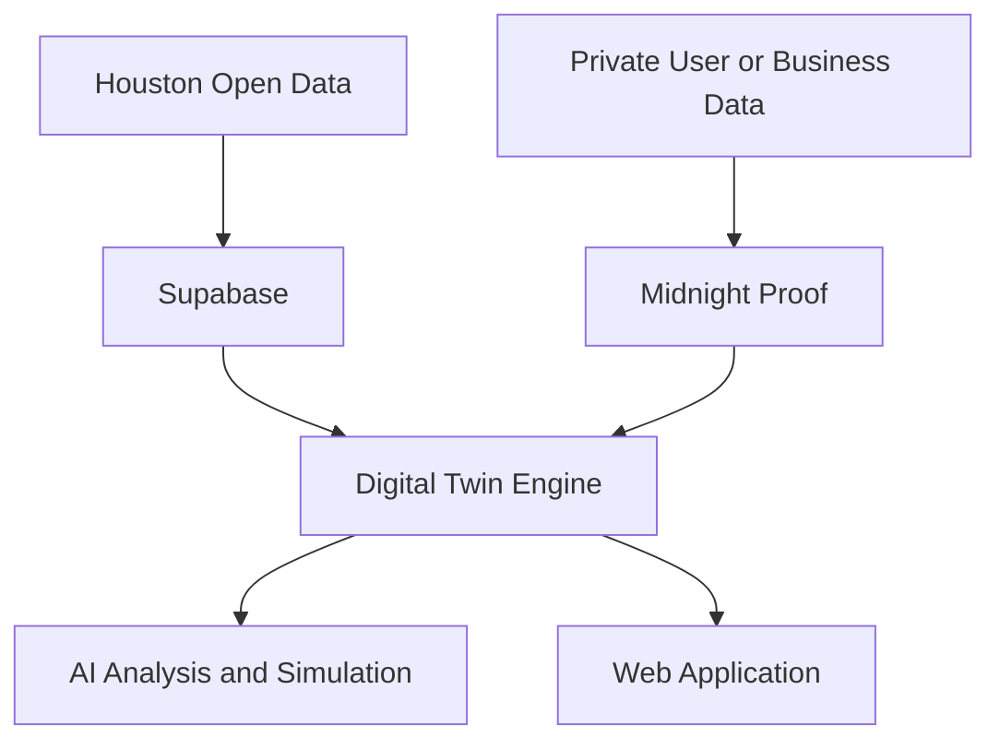

# AITX Houston Hackathon Ideas

## Midnight Blockchain + Digital Twin Concepts by Track

This document presents four original hackathon concepts for the City of Houston Open Data tracks:

1. Finance
2. Public Safety
3. Environment
4. Geospatial

Each concept combines:

- A real digital twin that represents a changing physical entity, organization, or operational process
- AI-assisted analysis, prediction, or simulation
- Midnight blockchain for programmable privacy, zero-knowledge verification, and selective disclosure
- Houston open data as the public-data foundation
- A focused prototype that can be demonstrated within a one-day hackathon

The blockchain should not duplicate public datasets. Houston open data belongs in a conventional database. Midnight should verify private facts and publish only the minimum proof required by the application.

---

## Track 1: Finance

# BidTwin

## Concept

**BidTwin creates private digital twins of small businesses and tests their readiness for City of Houston procurement opportunities.**

Small businesses frequently spend significant time preparing government bids before discovering that they lack a required certification, insurance threshold, staffing level, financial capacity, or past-performance qualification. They may also have to submit the same sensitive documents repeatedly.

BidTwin allows a business to create a confidential operational profile and compare it with historical or active solicitations before beginning a full application.

## The Digital Twin

The business twin represents its current operational capacity, including:

- Available employees
- Qualified subcontractors
- Equipment and inventory
- Insurance coverage
- Required certifications
- Financial capacity
- Geographic service area
- Previous project experience
- Contract-performance history

The twin changes as the business hires employees, obtains certifications, purchases insurance, adds equipment, or forms a partnership.

## Midnight's Role

Midnight allows the business to prove that it satisfies procurement requirements without publicly revealing its confidential records.

Example proofs:

- Insurance coverage is above the required threshold.
- The company has enough available personnel.
- A required percentage of subcontracting is assigned to qualifying local firms.
- The business has sufficient financial capacity for the contract.
- Required certifications are active and have not expired.
- The bidder has completed a minimum number of comparable projects.

The verifier receives a pass/fail proof rather than payroll files, bank statements, employee identities, customer lists, or proprietary pricing information.

## AI Component

The AI procurement assistant:

- Extracts requirements from solicitation documents
- Matches businesses with appropriate opportunities
- Identifies qualification gaps
- Explains disqualification risks in plain language
- Recommends the smallest set of changes necessary to qualify
- Generates a readiness checklist and submission timeline

## Simulation Experience

A business owner can ask:

> If I add two qualified employees, increase my insurance coverage, or partner with another contractor, will the company become eligible for this opportunity?

The twin updates those variables and recalculates readiness.

## One-Day MVP

1. Import a small sample of Houston archived solicitations.
2. Create one fictional small-business profile.
3. Define five private qualification variables.
4. Match the business against three solicitations.
5. Display the missing requirements for each opportunity.
6. Allow the user to change one business variable.
7. Generate a Midnight proof showing that the company now qualifies.
8. Display a public **Eligibility Verified** badge without revealing the private supporting data.

## Potential Customers

- Small businesses
- Chambers of commerce
- Procurement accelerators
- Municipal governments
- Prime contractors seeking qualified subcontractors
- Economic-development organizations

## Strategic Assessment

BidTwin has the strongest standalone business opportunity because the qualification problem exists across cities, counties, school districts, universities, and federal procurement systems.

---

## Track 2: Public Safety

# SafeServe Twin

## Concept

**SafeServe Twin creates a continuously updated food-safety twin for restaurants, grocery stores, food trucks, commercial kitchens, and other food-service facilities.**

A conventional inspection captures conditions at one moment. It does not show whether refrigeration failed after the inspector left, whether corrective actions remained in place, or whether the facility is moving toward its next violation.

SafeServe Twin converts inspection history and private operational evidence into a living safety model.

## The Digital Twin

The facility twin can represent:

- Inspection history
- Refrigeration-temperature compliance
- Cleaning and sanitation completion
- Food-handler certification coverage
- Equipment-maintenance status
- Corrective-action deadlines
- Recurring violation categories
- Estimated risk of another violation

The twin changes as new inspections, sensor readings, maintenance events, staff training, and remediation evidence are recorded.

## Midnight's Role

Facilities can prove that safety requirements were satisfied without publishing their complete internal operations.

Example proofs:

- Refrigeration remained within an approved temperature range.
- Required cleaning checks were completed.
- Enough certified employees were present during operating hours.
- A cited problem was corrected before its deadline.
- Maintenance evidence has not been changed after submission.

The public sees a verified status without receiving employee schedules, worker identities, internal logs, proprietary procedures, or raw sensor histories.

Midnight can also support confidential worker reporting. A worker could prove that they belong to the facility without publicly revealing their identity.

## AI Component

The AI safety assistant:

- Detects recurring violation patterns
- Predicts the most likely next failure
- Explains risk factors in plain language
- Recommends corrective actions
- Prioritizes equipment maintenance
- Generates a remediation checklist

## Simulation Experience

A manager can ask:

> What happens to our inspection risk if this refrigerator remains unstable for another 48 hours?

The twin simulates the likely effect on food-safety risk and recommends an intervention.

## One-Day MVP

1. Load a sample of Houston food-facility inspection records.
2. Create one fictional restaurant twin.
3. Display its inspection and violation history.
4. Simulate an unsafe refrigeration reading.
5. Use AI to identify the risk and recommend remediation.
6. Enter private mock maintenance and temperature evidence.
7. Generate a Midnight proof that the corrective conditions were satisfied.
8. Update the public status from **At Risk** to **Remediation Verified**.

## Potential Customers

- Restaurants and restaurant groups
- Grocery stores
- Food trucks
- Commercial kitchens
- Health departments
- Property and facility managers
- Insurers

## Strategic Assessment

SafeServe Twin offers the strongest balance between civic benefit, public safety, commercial demand, and an understandable demonstration.

---

## Track 3: Environment

# LoopCity Twin

## Concept

**LoopCity Twin creates a privacy-preserving digital twin of Houston's recyclable-material flow.**

A facility map can show where material might go, but it does not prove that material was collected, processed, recovered, or counted only once. Businesses may want to demonstrate environmental performance without exposing their suppliers, customers, waste volumes, or commercial relationships.

LoopCity Twin follows recyclable material from its source through collection, processing, and recovery.

## The Digital Twin

Each simulated material batch has a changing lifecycle state:

1. Created
2. Scheduled for pickup
3. Collected
4. Received by a facility
5. Inspected for contamination
6. Processed
7. Recovered or rejected

The batch twin can include:

- Material category
- Approximate weight
- Pickup status
- Processing status
- Contamination rate
- Receiving facility
- Recovery outcome
- Environmental-impact estimate

## Midnight's Role

Midnight allows organizations to prove environmental performance without exposing their full commercial activity.

Example proofs:

- A material batch was received by an approved facility.
- The same batch was not claimed twice.
- A company diverted at least a required percentage of eligible material.
- A facility processed a batch within an approved time window.
- Reported diversion totals are supported by valid underlying records.

The public proof does not need to reveal customer identities, exact pickup locations, supplier relationships, contract prices, or proprietary waste volumes.

## AI Component

The AI circularity assistant:

- Predicts facility-capacity constraints
- Recommends the most appropriate facility for each material type
- Flags contamination risks
- Estimates avoided landfill volume
- Identifies neighborhoods or business categories with diversion opportunities
- Explains environmental impact in plain language

## Simulation Experience

Users can test scenarios such as:

- What if participation rises by 15 percent?
- Which facility reaches capacity first?
- How much additional landfill waste could be avoided?
- How would contamination reduction affect recovery totals?
- Where should a temporary collection site be placed?

## One-Day MVP

1. Map Houston disposal and recycling facilities.
2. Generate five fictional material batches.
3. Simulate the movement of each batch through collection and processing.
4. Attempt to claim one batch twice.
5. Have the Midnight contract reject the duplicate claim.
6. Display verified diversion totals.
7. Run one participation or capacity simulation.

## Potential Customers

- Property-management companies
- Stadiums and event venues
- Universities and school districts
- Corporate sustainability teams
- Waste and recycling contractors
- Municipal governments
- ESG reporting platforms

## Strategic Assessment

LoopCity Twin provides the strongest blockchain justification because confidential reporting, verification, and double-count prevention are core product requirements rather than optional additions.

---

## Track 4: Geospatial

# CurbTwin Houston

## Concept

**CurbTwin Houston creates a dynamic digital twin of curb space, beginning with the Washington Avenue Parking Benefit District.**

A curb is usually treated as static pavement. In reality, the same space may serve residents, restaurant customers, deliveries, rideshare pickups, accessible parking, emergency vehicles, and event traffic at different times.

CurbTwin models every block face as a configurable public asset.

## The Digital Twin

The curb twin represents:

- Individual curb spaces or zones
- Current permitted use
- Time-based restrictions
- Parking occupancy
- Turnover rate
- Delivery demand
- Rideshare demand
- Event conditions
- Pricing
- Meter revenue
- Revenue returned to the district

The twin changes based on time, demand, events, temporary restrictions, and policy decisions.

## Midnight's Role

Drivers, residents, and commercial operators can prove eligibility without publishing their complete identity or movement history.

Example proofs:

- A driver is a qualifying district resident.
- A vehicle has an active commercial-delivery authorization.
- A driver qualifies for a particular parking accommodation.
- Payment was completed.
- A discount or permit has not expired.
- An anonymous occupancy submission came from an authorized participant.

The application verifies the rule without publishing a person's home address, license-plate history, identity records, or complete travel pattern.

## AI Component

The AI curb-management assistant:

- Forecasts demand by time of day
- Recommends temporary curb allocations
- Predicts congestion and parking turnover
- Estimates revenue effects
- Identifies delivery and rideshare conflicts
- Explains the likely effect of a proposed policy change

## Simulation Experience

City planners or district managers can test:

- Converting three parking spaces into delivery zones
- Changing meter prices during peak hours
- Reserving curb space for rideshare during events
- Creating temporary pedestrian zones
- Returning a larger percentage of revenue to district improvements
- Moving loading activity away from a congested block

The model estimates changes in occupancy, turnover, congestion, access, and revenue.

## One-Day MVP

1. Render the Washington Avenue Parking Benefit District on a map.
2. Create one block with ten simulated curb spaces.
3. Model morning, evening, and event-night demand.
4. Add controls for parking, delivery, and rideshare allocations.
5. Allow a mock resident to privately prove discount eligibility.
6. Allow a mock delivery operator to prove commercial authorization.
7. Show how each allocation changes occupancy, congestion, and revenue.

## Potential Customers

- Municipal governments
- Parking-benefit districts
- Airports
- Universities
- Event venues
- Mixed-use developments
- Delivery and logistics platforms
- Mobility-management companies

## Strategic Assessment

CurbTwin Houston offers the strongest hackathon presentation because the judges can see the city asset change on a map, manipulate variables, and immediately understand the effect.

---

## Concept Comparison

| Rank | Concept | Track | Strongest advantage | Primary challenge |
|---:|---|---|---|---|
| 1 | CurbTwin Houston | Geospatial | Most visual and memorable digital-twin demonstration | Requires believable simulated demand data |
| 2 | SafeServe Twin | Public Safety | Clear public benefit and commercial market | Private operating data must be simulated for the prototype |
| 3 | BidTwin | Finance | Strongest standalone business opportunity | Solicitation requirement extraction must remain narrowly scoped |
| 4 | LoopCity Twin | Environment | Strongest blockchain-native verification case | Public datasets provide facilities but limited material-flow activity |

---

## Recommended Hackathon Build

# CurbTwin Houston

CurbTwin Houston is the recommended competition project because it provides:

- A visibly changing digital twin
- A Houston-specific starting location
- A clear geospatial interface
- Meaningful AI simulation
- A legitimate privacy problem for Midnight
- A strong three-minute demonstration
- Expansion potential beyond the hackathon

## Recommended Demo Story

1. Open the Washington Avenue district map.
2. Select one congested block.
3. Show the current ten-space curb configuration.
4. Activate **Event Night**.
5. Display increased rideshare, parking, and delivery demand.
6. Ask the AI assistant for a recommended allocation.
7. Convert selected spaces into timed rideshare and delivery zones.
8. Show the predicted change in congestion, occupancy, turnover, and revenue.
9. Have a mock resident prove discount eligibility privately.
10. Display **Eligibility Verified** without exposing the resident's underlying information.

---

## Shared Technical Architecture

All four concepts can use the same basic architecture:

### Supabase

- PostgreSQL database
- Authentication
- Open-data ingestion
- Application state
- Realtime updates
- Scenario history

### AI Layer

- Natural-language questions
- Requirement extraction
- Risk explanation
- Recommendations
- Scenario summaries
- Anomaly detection

### Midnight Layer

- Private inputs
- Zero-knowledge verification
- Selective disclosure
- Proof status
- Duplicate-claim prevention where applicable

### Frontend

- Track-specific dashboard
- Digital-twin visualization
- Scenario controls
- Verification workflow
- Before-and-after results

---

## Scope Discipline

### Build

- One track
- One narrow user problem
- One digital twin
- One AI-assisted simulation
- One Midnight proof
- One polished demonstration story

### Do Not Build

- A complete city platform
- A general-purpose chatbot
- Cryptocurrency payments
- Token rewards without a necessary economic function
- A large decentralized governance system
- Multiple blockchains
- Every dataset in the selected track
- A prediction model presented as scientifically validated when it uses mock data

---

## Official Resources

- [City of Houston Open Data](https://data.houstontx.gov/)
- [Houston Finance Data](https://data.houstontx.gov/group/finance)
- [Houston Public Safety Data](https://data.houstontx.gov/group/public-safety)
- [Houston Environment Data](https://data.houstontx.gov/group/environment)
- [Houston Geospatial Data](https://data.houstontx.gov/group/geospatial)
- [Midnight Developer Documentation](https://docs.midnight.network/)
- [AITX Houston Hackathon](https://luma.com/aitx-ise0)
