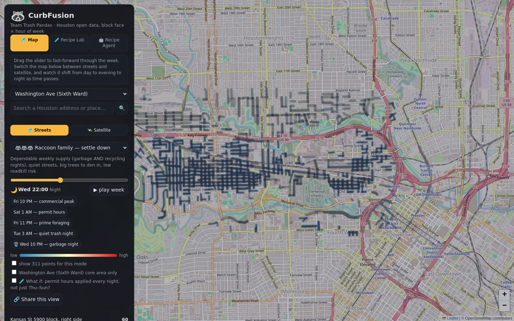
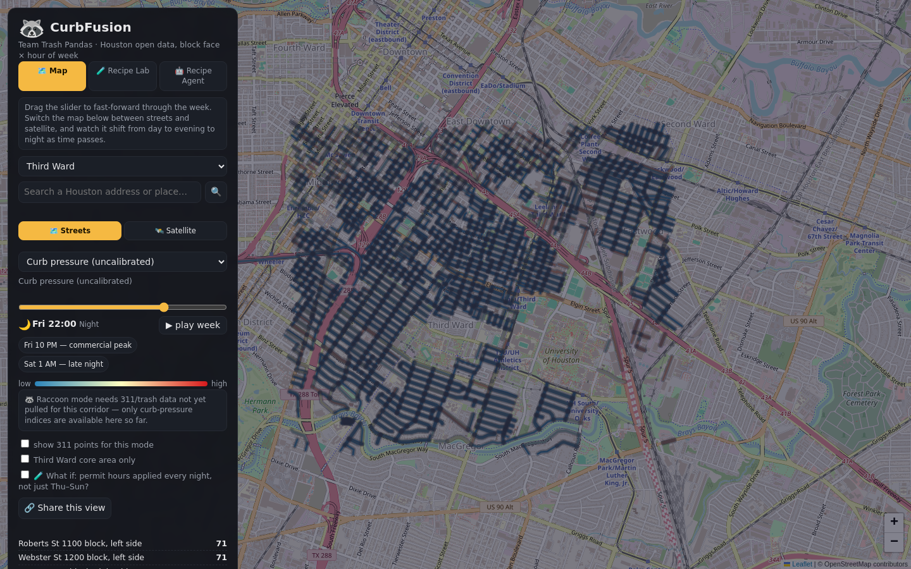
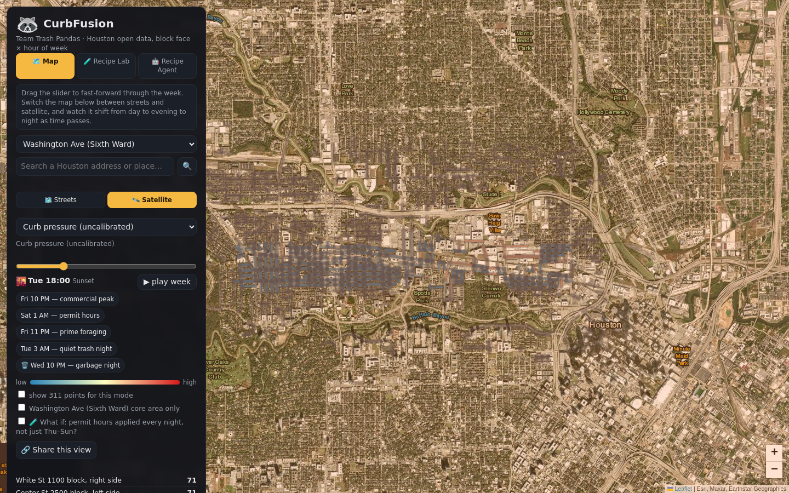
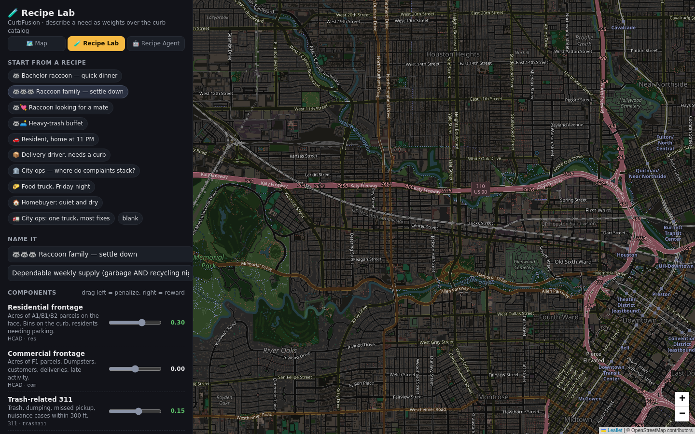
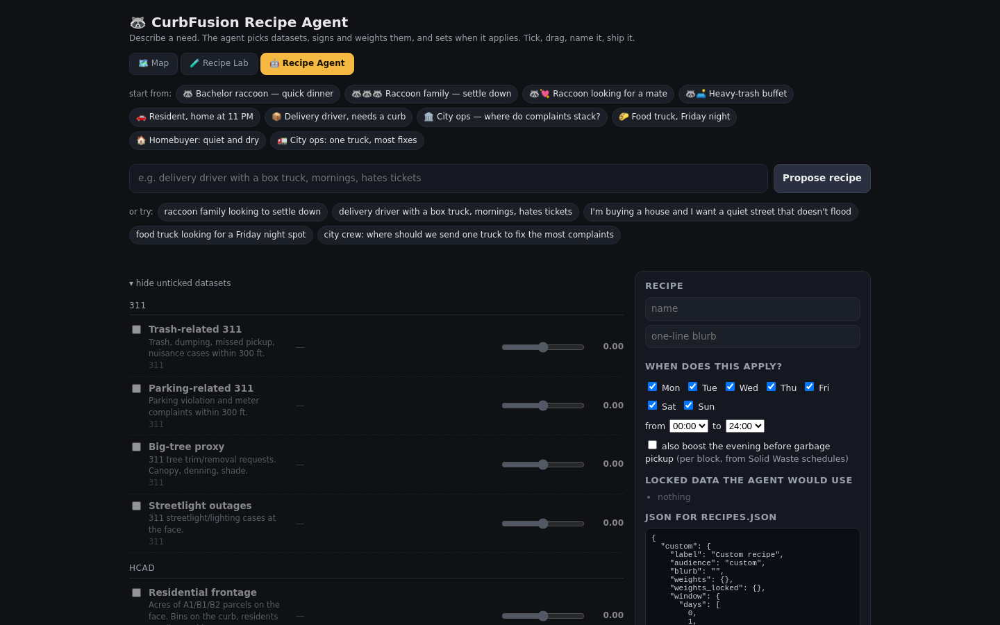
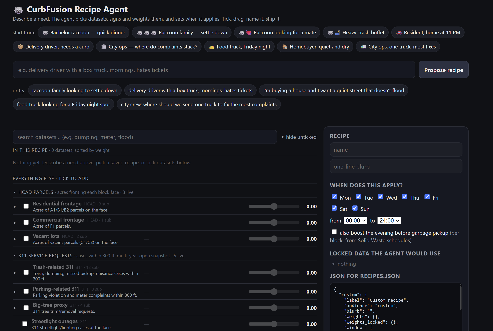
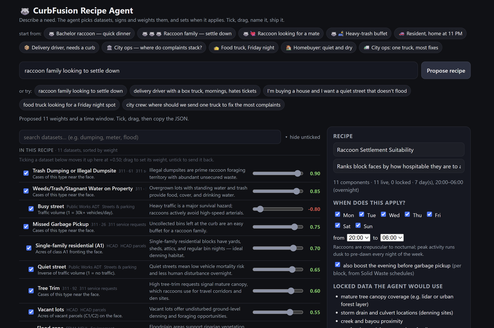
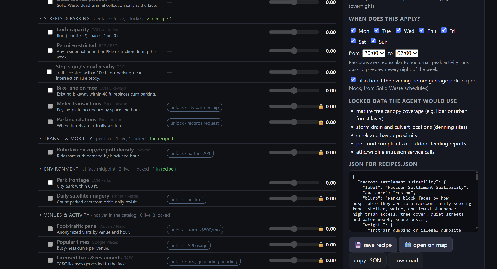

# Screenshots

Two sets below: what's actually running in this repo today, and a preview of work your partner
has in progress that hasn't landed here yet. Kept separate deliberately — this project's whole
premise is not claiming things that aren't real yet.

## The live app

### Map — Raccoon mode, Sixth Ward, Wednesday 10 PM

Garbage pickup is Thursday, so bins are out tonight — Solid Waste polygons, 311 tree-trim
requests, dead-animal calls, and quiet-street traffic counts combine into one foraging score.
None of those datasets mention raccoons individually.

### Map — Curb pressure, Third Ward

Same engine, different corridor, different recipe — proof this isn't hardcoded to one street.
The banner honestly notes Raccoon mode isn't available here yet (no 311/waste data pulled for
this corridor), rather than faking a score.

### Map — Satellite basemap, sunset

The day → evening → night visual treatment works over both basemaps; this is the sunset
transition around 6 PM.

### Recipe Lab

Drag weights over the same component catalog the map uses, watch the map recolor live.

### Recipe Agent (current)

Describe a need in a sentence, get back signed weights and a time window with a reason per
dataset. This is the version currently wired into `src/recipe_agent.html`.

## Preview: upcoming Recipe Agent (not yet merged)

Your partner is building a significantly expanded version of the Recipe Agent — categorized
dataset browsing, per-category live/locked counts, a "locked data the agent would use" section,
and save/open-on-map actions. These screenshots are from that in-progress build, not from
anything currently running in this repo; they're included here as a preview so the direction is
documented, not as a claim about current functionality.

### Empty state — categorized catalog

### Proposed recipe with reasons per component

### Catalog detail — locked/licensed data and JSON export

Once this build is handed off and merged, this section should move up into "The live app" above.
